Analysis and Exploration on Prosper Loan Data
================
Nisrein Sada
December 8, 2018

In this Exploration we are looking into dataset that contains 113,937 propser loans with the following attributes: loan amount, borrower income, borrower rate ,borrower employment status. This will help us study the loans and the borrowers. Propser is a peer-to-peer lending platform where individuals can either invest or borrow loan. I am trying to look into 3 main questions:

1.  find the characteristics of borrowers? by looking into the following variables borrowerRate, borrowerAPR, income-range, IncomeToDebtRatio,creditScoreRating,...

2.  find the characteristic of the loan? using the following variables: loan status, loanPropserRating, loanGrade, loan term, loanListingYear,..

3.  why people lend money? looking into the loan listing categories. \# Univariate Plots Section

i will start the investigation by looking at the loan amount

### How much people borrow (LoanOriginalAmount):

    ##    Min. 1st Qu.  Median    Mean 3rd Qu.    Max. 
    ##    1000    4000    6500    8337   12000   35000

    ## [1] 8000

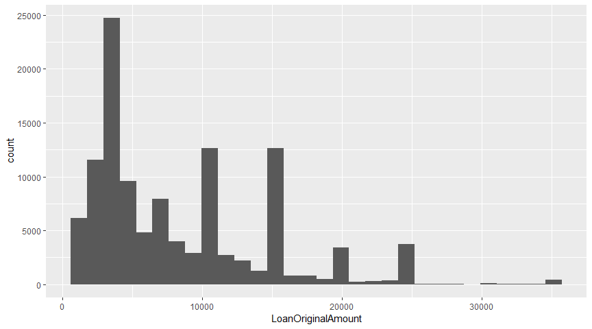

In the above figure we noticed that it is the loan amount is right skewed and is long tailed and this was fixed it to better understand the amount of loans using log10 tranformation as can be seen in the following figure. i also used IQR range to limit x axis values considering values above IQR\*1.5 from Q3 as outliers.

The binwidth was choosen using Freedman-Diaconis rule. The loan median is 6500 which means 50% of data is below this number and 50% is higer than this. from the histogram below we can see that the most frequent loan amount is 4000 and the second most is 15000 followed by 11000

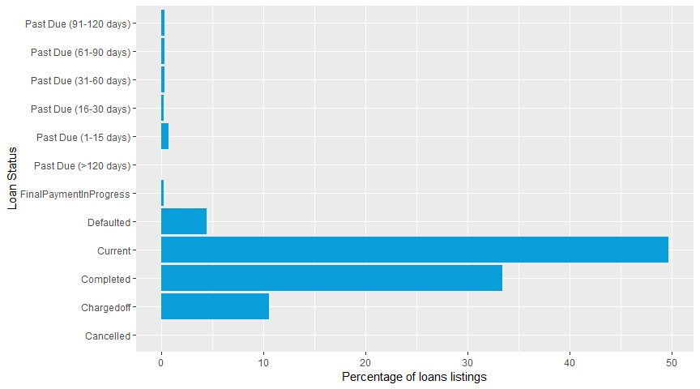

What are the categories the loans are listed under (Listing Category of loan):
------------------------------------------------------------------------------

The category of the listing that the borrower selected when posting their listing: 0 - Not Available, 1 - Debt Consolidation, 2 - Home Improvement, 3 - Business, 4 - Personal Loan, 5 - Student Use, 6 - Auto, 7- Other, 8 - Baby&Adoption, 9 - Boat, 10 - Cosmetic Procedure, 11 - Engagement Ring, 12 - Green Loans, 13 - Household Expenses, 14 - Large Purchases, 15 - Medical/Dental, 16 - Motorcycle, 17 - RV, 18 - Taxes, 19 - Vacation, 20 - Wedding Loans.I created a labeled column for the listing.

from the histogram most of the loans are listed under Debt Consolidation category \[number 1\] with 51.25 of all the loans followed by Not Available with 14.9% . and the least listings are for RVs and Green loans with 0.0456% and 0.0518% respectively.

    ## # A tibble: 21 x 3
    ##    ListingCategory..numeric.     n     freq
    ##                        <int> <int>    <dbl>
    ##  1                        17    52 0.000456
    ##  2                        12    59 0.000518
    ##  3                         9    85 0.000746
    ##  4                        10    91 0.000799
    ##  5                         8   199 0.00175 
    ##  6                        11   217 0.00190 
    ##  7                        16   304 0.00267 
    ##  8                         5   756 0.00664 
    ##  9                        19   768 0.00674 
    ## 10                        20   771 0.00677 
    ## # ... with 11 more rows

    ##      Not Available Debt Consolidation   Home Improvement 
    ##              16965              58308               7433 
    ##           Business      Personal Loan        Student Use 
    ##               7189               2395                756 
    ##               Auto              Other      Baby&Adoption 
    ##               2572              10494                199 
    ##               Boat Cosmetic Procedure    Engagement Ring 
    ##                 85                 91                217 
    ##        Green Loans Household Expenses    Large Purchases 
    ##                 59               1996                876 
    ##     Medical/Dental         Motorcycle                 RV 
    ##               1522                304                 52 
    ##              Taxes           Vacation      Wedding Loans 
    ##                885                768                771

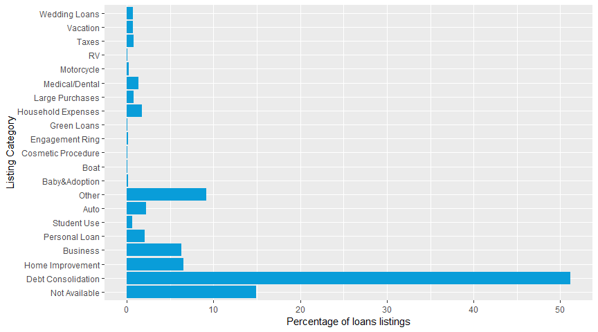

### Loans Status

The percentage of current loans in the data we have is 49.7%. the percent of default is 4.4%. The categories in the loan status are: Cancelled, Chargedoff, Completed, Current, Defaulted, FinalPaymentInProgress, PastDue. The PastDue status will be accompanied by a delinquency bucket which are (1-15 days, 16-30 days, 31-60 days , 61-90 days and 91-120 days). The loan categories explained: - cancelled: does not have to paid. - Chargedoff: loan is more than 120day past due. - default: failure to repay a loan for an extended period off time.

    ##              Cancelled             Chargedoff              Completed 
    ##                      5                  11992                  38074 
    ##                Current              Defaulted FinalPaymentInProgress 
    ##                  56576                   5018                    205 
    ##   Past Due (>120 days)   Past Due (1-15 days)  Past Due (16-30 days) 
    ##                     16                    806                    265 
    ##  Past Due (31-60 days)  Past Due (61-90 days) Past Due (91-120 days) 
    ##                    363                    313                    304

### LoanStatus modified

reduce the number of levels in loan status. by combining the pastdue status together, charged off with defaulted, payment in progress with current and cancelled with completed since it will not require any payment. so the new variable has 4 levels. the percentage of current loans is 49%, pastdue is around 2%, defaulted around 15% and completed around 33% .

    ##  [1] "Cancelled"              "Chargedoff"            
    ##  [3] "Completed"              "Current"               
    ##  [5] "Defaulted"              "FinalPaymentInProgress"
    ##  [7] "Past Due (>120 days)"   "Past Due (1-15 days)"  
    ##  [9] "Past Due (16-30 days)"  "Past Due (31-60 days)" 
    ## [11] "Past Due (61-90 days)"  "Past Due (91-120 days)"

    ## [1] "Completed" "Defaulted" "Current"   "Past Due"

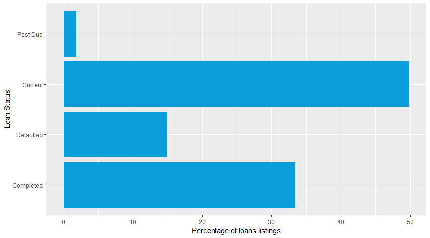

### Employment status

The percentage of the Employed in the data we have is 59.1%. and the percent of not employed is 0.733%. this column has an empty level which i will replace with not available level.

    ##                    Employed     Full-time Not available  Not employed 
    ##          2255         67322         26355          5347           835 
    ##         Other     Part-time       Retired Self-employed 
    ##          3806          1088           795          6134

    ## [1] ""              "Employed"      "Full-time"     "Not available"
    ## [5] "Not employed"  "Other"         "Part-time"     "Retired"      
    ## [9] "Self-employed"

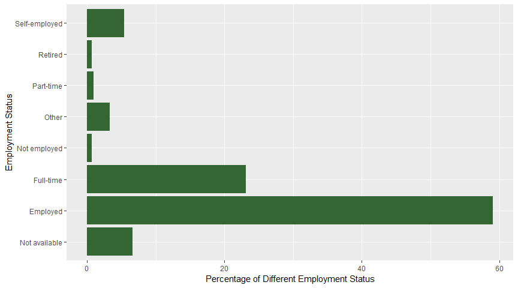

### Employment status Modified

the highest percentage is for the employed.

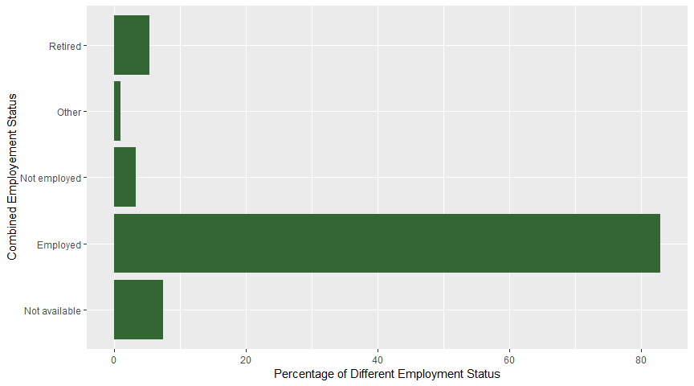

### How much borrower earn(Income range):

most of the income range in this data is 25,000-49,999 followed by 50,000 - 74,999. and this seems like normally distributed Income range. we can that the number of unemployed is low compared to other income segments. it is worth mentioning that income range of 0 does not make sense and needs investigation on what it means. it might be missing data though it is not mentioned in the data description.

    ##             $0      $1-24,999      $100,000+ $25,000-49,999 $50,000-74,999 
    ##            621           7274          17337          32192          31050 
    ## $75,000-99,999  Not displayed   Not employed 
    ##          16916           7741            806

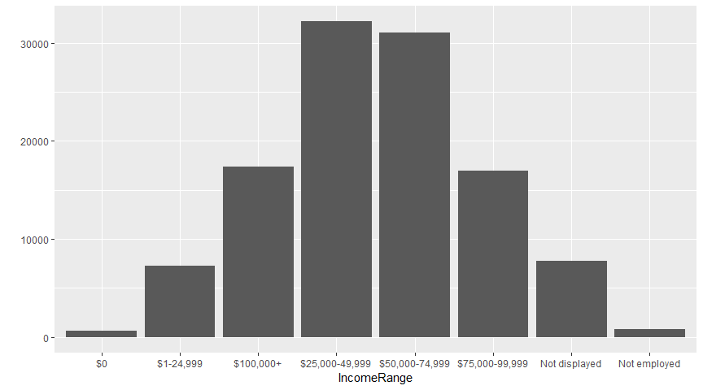

### AvailableBankcardCredit

I removed the NA values and the resulting histogram was long tailed. The median is 4100,

    ##    Min. 1st Qu.  Median    Mean 3rd Qu.    Max. 
    ##       0     880    4100   11210   13180  646285

    ## [1] 12300

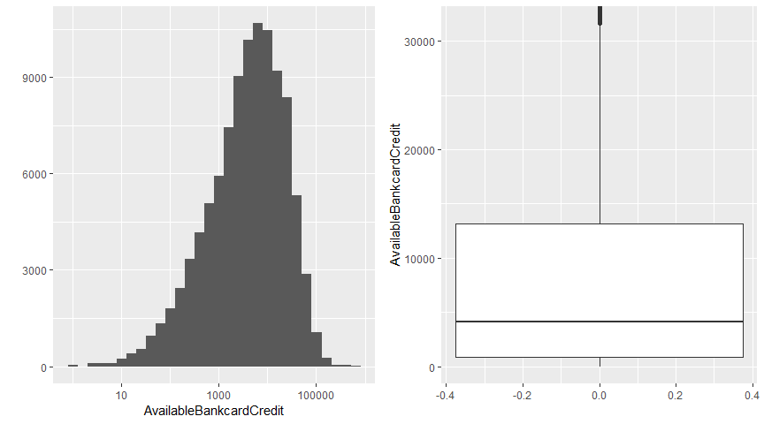

### Debt to income ratio

I removed the NA values (8554) and the resulting histogram was long tailed. the median is 0.220 and the values are from 0 - 10.010 though the Q3 is 0.320 so i removed the values that can be outliers based on any value greater than IQR\*1.5 + Q3

    ##    Min. 1st Qu.  Median    Mean 3rd Qu.    Max.    NA's 
    ##   0.000   0.140   0.220   0.276   0.320  10.010    8554

    ##    Min. 1st Qu.  Median    Mean 3rd Qu.    Max. 
    ##  0.0000  0.1400  0.2200  0.2759  0.3200 10.0100

    ## [1] 0.18

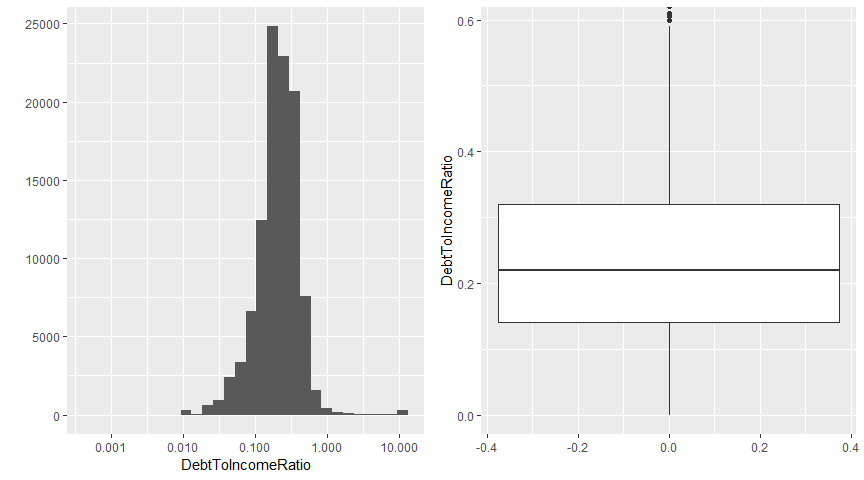

### TotalProsperLoans :

Number of previous loans. i replaced NA values with 0 since the nulls in this columns corresponds to no prior loans. most of the loans here don't have previous loans\[90852 records\].

    ##    Min. 1st Qu.  Median    Mean 3rd Qu.    Max.    NA's 
    ##    0.00    1.00    1.00    1.42    2.00    8.00   91852

    ##    Min. 1st Qu.  Median    Mean 3rd Qu.    Max. 
    ##  0.0000  0.0000  0.0000  0.2755  0.0000  8.0000

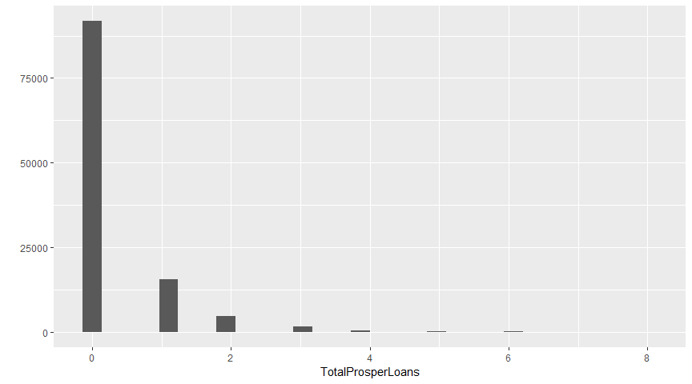

### CreditScore:

A credit score is a numerical expression based on a level analysis of a person's credit files, to represent the creditworthiness of an individual. I combined the lower and upper range of the present credit score to get the range. we have 591 missing values and most of the data in range 660-679 and 680-699.

    ##    0-19 360-379 420-439 440-459 460-479 480-499 500-519 520-539 540-559 
    ##     133       1       5      36     141     346     554    1593    1474 
    ## 560-579 580-599 600-619 620-639 640-659 660-679 680-699 700-719 720-739 
    ##    1357    1125    3602    4172   12199   16366   16492   15471   12923 
    ## 740-759 760-779 780-799 800-819 820-839 840-859 860-879 880-899   NA-NA 
    ##    9267    6606    4624    2644    1409     567     212      27     591

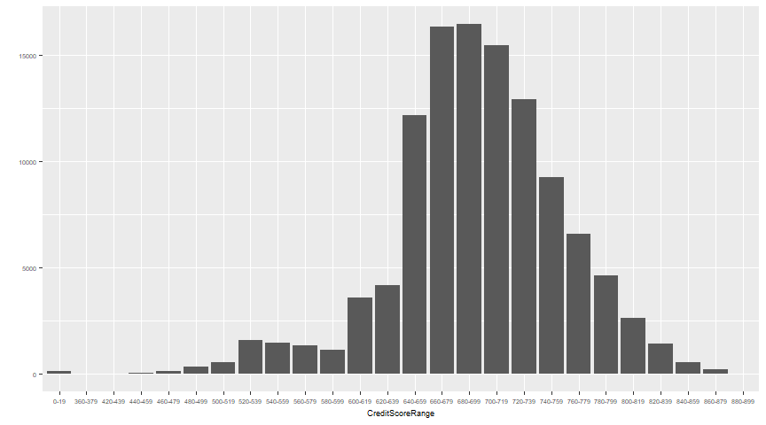

### CreditRating:

This rating is based on the creditscore range as a metric categorize the score ranges in 5 ratings (Very Poor, Fair, Good, Very Good, Exceptional). we used the following rating for the score ranges : ratings for the scores: 300 -579 --&gt; very poor 580 - 669 --&gt; Fair 670 - 739 --&gt; Good 740 - 799 --&gt; very good 800 - 850 --&gt; Exceptional from the barplot we can see that most of the scores are in Very Good and Good credit rating

    ## Exceptional   Very Good        Good        Fair   Very Poor           0 
    ##       13874       54153       36339        6632         133        2806

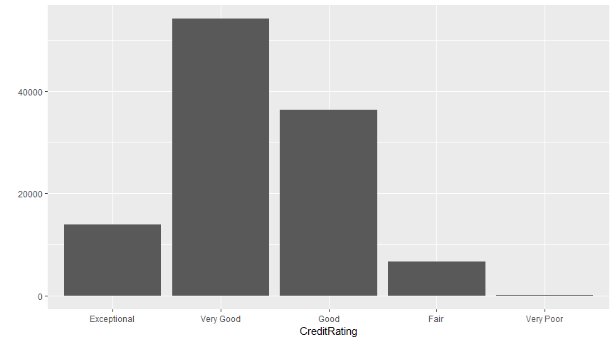

### BorrowerRate :

The Borrower's interest rate for this loan.we can see that the borrower rates in the data range from 0 - 0.4975 with 50% of the data around a rate of 18.4% and a mean of 19.28% data.

    ##    Min. 1st Qu.  Median    Mean 3rd Qu.    Max. 
    ##  0.0000  0.1340  0.1840  0.1928  0.2500  0.4975

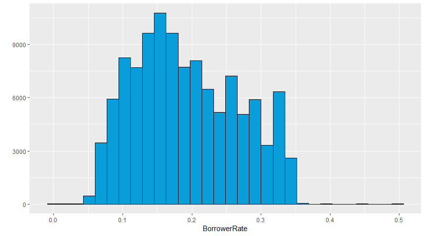

### BorrowerAPR :

The Borrower's Annual Percentage Rate (APR) for the loan.we can see that the borrower rates in the data range from 0.00653% - 0.51229 with 50% of the data around a rate of 20.976% and a mean of 21.88% data. The difference between APR and borrower rate that APR reflects not only the interest rate and it depends upon credit score, Prosper Rating, loan amount, credit usage and history.

    ##    Min. 1st Qu.  Median    Mean 3rd Qu.    Max.    NA's 
    ## 0.00653 0.15629 0.20976 0.21883 0.28381 0.51229      25

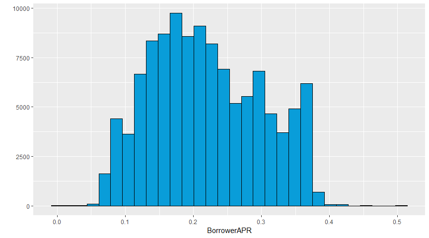

### Loan Term :

The length of the loan expressed in months. Most of the loan terms are 36 months (3 years) then 60 months (5 years) and the least common term is 12 months (1 year term loan).

    ##    Min. 1st Qu.  Median    Mean 3rd Qu.    Max. 
    ##   12.00   36.00   36.00   40.83   36.00   60.00

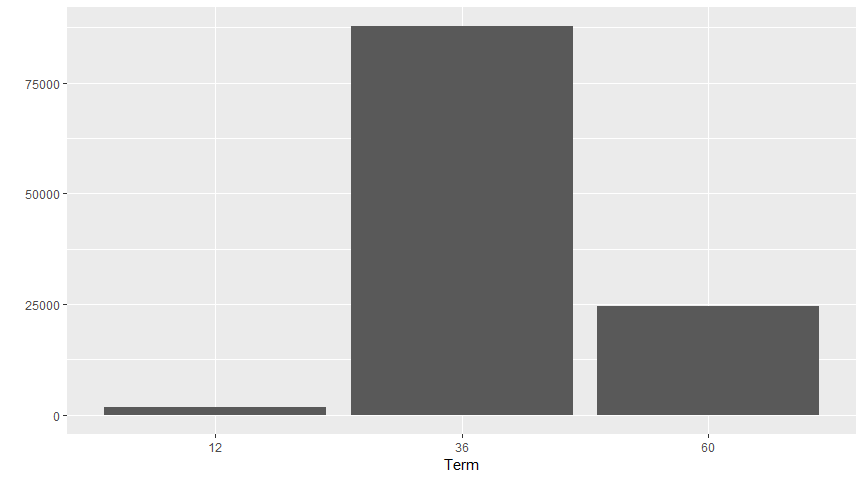

    ##    12    36    60 
    ##  1614 87778 24545

### Listing Year and listing month:

Here i try to extract the year and the month of the loans listing to see the number of listings per year/month. In terms of years, year 2013 had the most listings followed by 2012 while the least listings were in year 2005 followed by 2009(2005 was the year the company propser was founded and for 2009 year to have less listing it does make sense since it follows the economical crises and collapse of the investment bank Lehman Brothers). The listing months don't have much difference in terms of loans listings though januray have more listings compared to other months.

    ##  2005  2006  2007  2008  2009  2010  2011  2012  2013  2014 
    ##    23  6213 11557 11263  2206  5530 11442 19556 35413 10734

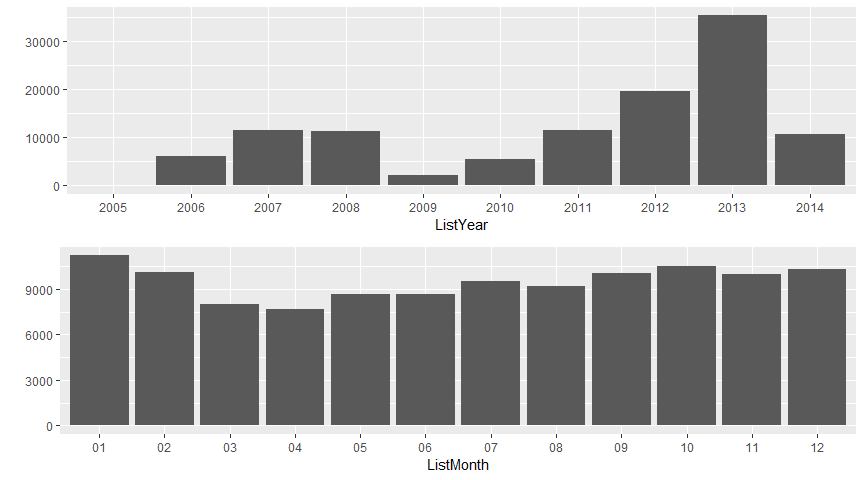

    ##    01    02    03    04    05    06    07    08    09    10    11    12 
    ## 11214 10124  8032  7661  8641  8672  9506  9202 10074 10539  9952 10320

### CreditGrade and propserRating:

These two varaibles are used as metric of expected risk associated with the listing. creditgrade was used for the period pre2009 that was changed to propserRating after July-2009.
From lowest-risk to highest-risk, are labeled AA, A, B, C, D, E, and HR ("High Risk") \[this based on the propser score which is based on the historical data of the user credit and the credit score for the borrower\] for the period pre-2009 around 20% was for Grade Cc and around 12% of the loans were high risk loans and it was the same percentage for A loans. while for the post2009 period C still had the highest loans percentage and A percentage increased around 5% and HR loans decreased to around 8% of the total loans.

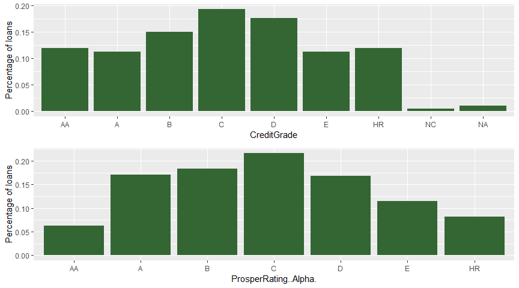

Univariate Analysis
===================

### What is the structure of your dataset?

The data contains 113937 observations and 81 variables.

### What is/are the main feature(s) of interest in your dataset?

The main features for the desired analysis for the borrower are the creditscore, the borrowerRate, Income range and debt to income ratio. and the main features for the loans are the loan status, loan term and loan amount. these factors will help us understand the features of the loans that are most likely to be completed or defaulted or charged off and what can affect the loan amount.

### What other features in the dataset do you think will help support your

(s) of ?

so the variables we will look that can help us understand the borrower and the loan category (variable: ListingCategory), Employement status of the borrower, TotalProsperLoans \[number of previous loans\] and the loan listing year (since the loans might be affected by financial crises or change of loan laws).

### Did you create any new variables from existing variables in the dataset?

I created the following new columns:

1.  The credit score range: i combined the creditscore upper range and lower range in one column to create levels of the ranges.

2.  labeled listing category: factor the listing category numbers and map it to the corrsponding label.
3.  CreditRating: divide the creditscore range into 5 ratings to make it easier to categorize the loans and the borrowers.

4.  listingDate, listing year, listing month: from the loan listing date i created these columns by extracting the data from the text and getting the required attribute.

5.  loanStatus modified. reduce the number of levels in loan status. by combining the pastdue status together, charged off with defaulted, payment in progress with current and cancelled with completed since it will not require any payment. so the new variable has 4 levels.

6.  employmentstatus,modified: merged the full time, part time and self-employed under employment status.

### Of the features you investigated, were there any unusual distributions?

you perform any operations on the data to tidy, adjust, or change the form the data? If so, why did you do this?

yes.

-   some of the variables were long tailed so for these variables such as (DebtToIncomeRatio, AvailableBankcardCredit) i used the log scale to get a normal distribution of the data.

-   for the boxplot: i considered values above 1.5\*IQR+Q3 as outliers and thus removed them from the plots for the AvailableBankcardCredit, DebtToIncomeRatio

-   The binwidth was choosen using Freedman-Diaconis rule.

-   some values were na so for the TotalProsperLoans corrsponding to the previous loans. i replaced the na's values with 0's since it was stated that na values meant there were no previous loans.

-   the employmentstatus column had an empty level which i replaced with not available level. other values that contained na's i removed them for the plots of the analysis to get better understanding of the variables and the distribution of the variables.

Bivariate Plots Section
=======================

The first part i am trying to look into variables that affect the loan amount for the borrower: such as IncomeRange, employment status, creditscore range, debtToIncomeRatio, ListingCategory for the loan, the number of previous loans, and DebtToIncomeRatio.

I created pairplot for some of the variables to get an intution about which ones can affect the loan amount. from the pairplot it seems that previous loans and income range and employment status might affect the loan amount.

also we can see that as expected the borrowerAPR and borrowerRate have a correlation of 0.99. other correlations include: - loan amount and borrower rate correlation of 0.329 - loan amount and borroweraPR 0.323 - loan amount and available bank credit 0.23 - borrower rate and available bank credit0.344 - borrowerAPR and available bank credit 0.349

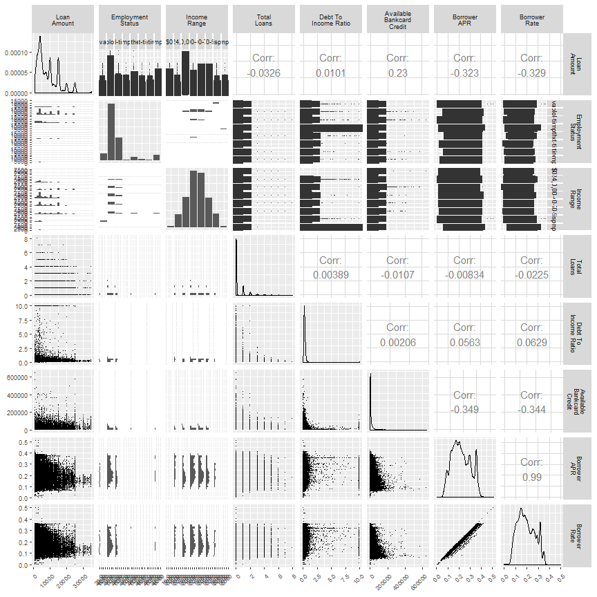

### Listing Category versus the loan amount

we can see from the boxplot how that for each listing we have a different loan amount ranges as can be seen in the summary and the boxplot. i will use the median for the analysis it is half point of the data and it is not affected by the outliers so the highest loan amounts corrsponding to the Debt Consolidation with 9500 median and it is followed by baby and adapotion with 9000 median value .and the interesting thing that can be seen here is that though Q3 for the Green loans making it seem like it is in third place but the median value is 5000 implying large outliers then the business listing for example which had a 7279. while the least amount was the student use loans.

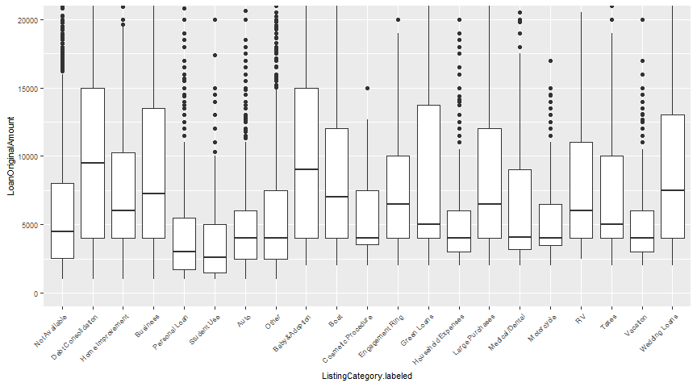

    ## loan_data$ListingCategory.labeled: Not Available
    ##    Min. 1st Qu.  Median    Mean 3rd Qu.    Max. 
    ##    1000    2550    4500    6254    8000   25000 
    ## -------------------------------------------------------- 
    ## loan_data$ListingCategory.labeled: Debt Consolidation
    ##    Min. 1st Qu.  Median    Mean 3rd Qu.    Max. 
    ##    1000    4000    9500    9908   15000   35000 
    ## -------------------------------------------------------- 
    ## loan_data$ListingCategory.labeled: Home Improvement
    ##    Min. 1st Qu.  Median    Mean 3rd Qu.    Max. 
    ##    1000    4000    6000    8092   10250   35000 
    ## -------------------------------------------------------- 
    ## loan_data$ListingCategory.labeled: Business
    ##    Min. 1st Qu.  Median    Mean 3rd Qu.    Max. 
    ##    1000    4000    7279    8927   13500   35000 
    ## -------------------------------------------------------- 
    ## loan_data$ListingCategory.labeled: Personal Loan
    ##    Min. 1st Qu.  Median    Mean 3rd Qu.    Max. 
    ##    1000    1700    3000    4557    5500   25000 
    ## -------------------------------------------------------- 
    ## loan_data$ListingCategory.labeled: Student Use
    ##    Min. 1st Qu.  Median    Mean 3rd Qu.    Max. 
    ##    1000    1500    2600    3515    4988   22000 
    ## -------------------------------------------------------- 
    ## loan_data$ListingCategory.labeled: Auto
    ##    Min. 1st Qu.  Median    Mean 3rd Qu.    Max. 
    ##    1000    2500    4000    5001    6000   35000 
    ## -------------------------------------------------------- 
    ## loan_data$ListingCategory.labeled: Other
    ##    Min. 1st Qu.  Median    Mean 3rd Qu.    Max. 
    ##    1000    2500    4000    5912    7500   35000 
    ## -------------------------------------------------------- 
    ## loan_data$ListingCategory.labeled: Baby&Adoption
    ##    Min. 1st Qu.  Median    Mean 3rd Qu.    Max. 
    ##    2000    4000    9000    9751   15000   30000 
    ## -------------------------------------------------------- 
    ## loan_data$ListingCategory.labeled: Boat
    ##    Min. 1st Qu.  Median    Mean 3rd Qu.    Max. 
    ##    2000    4000    7000    8734   12000   35000 
    ## -------------------------------------------------------- 
    ## loan_data$ListingCategory.labeled: Cosmetic Procedure
    ##    Min. 1st Qu.  Median    Mean 3rd Qu.    Max. 
    ##    2000    3550    4000    5684    7512   15000 
    ## -------------------------------------------------------- 
    ## loan_data$ListingCategory.labeled: Engagement Ring
    ##    Min. 1st Qu.  Median    Mean 3rd Qu.    Max. 
    ##    2000    4000    6500    7637   10000   27000 
    ## -------------------------------------------------------- 
    ## loan_data$ListingCategory.labeled: Green Loans
    ##    Min. 1st Qu.  Median    Mean 3rd Qu.    Max. 
    ##    2000    4000    5000    8457   13750   25000 
    ## -------------------------------------------------------- 
    ## loan_data$ListingCategory.labeled: Household Expenses
    ##    Min. 1st Qu.  Median    Mean 3rd Qu.    Max. 
    ##    2000    3000    4000    5285    6000   35000 
    ## -------------------------------------------------------- 
    ## loan_data$ListingCategory.labeled: Large Purchases
    ##    Min. 1st Qu.  Median    Mean 3rd Qu.    Max. 
    ##    2000    4000    6500    8772   12000   35000 
    ## -------------------------------------------------------- 
    ## loan_data$ListingCategory.labeled: Medical/Dental
    ##    Min. 1st Qu.  Median    Mean 3rd Qu.    Max. 
    ##    2000    3202    4075    6524    9000   25000 
    ## -------------------------------------------------------- 
    ## loan_data$ListingCategory.labeled: Motorcycle
    ##    Min. 1st Qu.  Median    Mean 3rd Qu.    Max. 
    ##    2000    3500    4000    5561    6500   35000 
    ## -------------------------------------------------------- 
    ## loan_data$ListingCategory.labeled: RV
    ##    Min. 1st Qu.  Median    Mean 3rd Qu.    Max. 
    ##    2500    4000    6000    8149   11000   25000 
    ## -------------------------------------------------------- 
    ## loan_data$ListingCategory.labeled: Taxes
    ##    Min. 1st Qu.  Median    Mean 3rd Qu.    Max. 
    ##    2000    4000    5000    7580   10000   35000 
    ## -------------------------------------------------------- 
    ## loan_data$ListingCategory.labeled: Vacation
    ##    Min. 1st Qu.  Median    Mean 3rd Qu.    Max. 
    ##    2000    3000    4000    5358    6000   35000 
    ## -------------------------------------------------------- 
    ## loan_data$ListingCategory.labeled: Wedding Loans
    ##    Min. 1st Qu.  Median    Mean 3rd Qu.    Max. 
    ##    2000    4000    7500    8836   13000   35000

### EmploymentStatus versus the loan amount

we can see from the boxplot how that for each employment status we have a different loan amount ranges as can be seen in the summary and the boxplot. With the highest loan amounts were given to the employed and the least amount given to the part timers. so this variable also seem to affect the borrower given loan amounts.

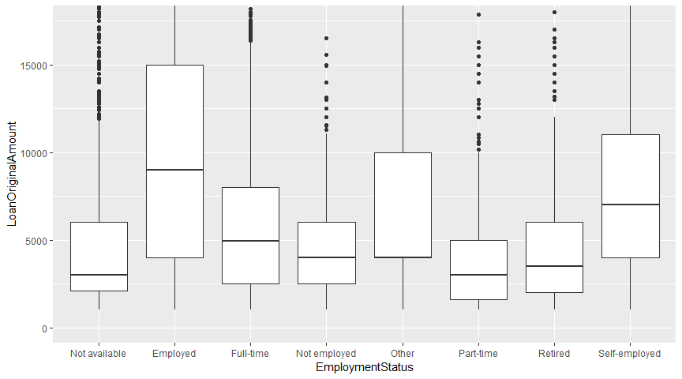

    ## loan_data$EmploymentStatus: Not available
    ##    Min. 1st Qu.  Median    Mean 3rd Qu.    Max. 
    ##    1000    2100    3001    5132    6001   25000 
    ## -------------------------------------------------------- 
    ## loan_data$EmploymentStatus: Employed
    ##    Min. 1st Qu.  Median    Mean 3rd Qu.    Max. 
    ##    1000    4000    9000    9794   15000   35000 
    ## -------------------------------------------------------- 
    ## loan_data$EmploymentStatus: Full-time
    ##    Min. 1st Qu.  Median    Mean 3rd Qu.    Max. 
    ##    1000    2500    4950    6195    8000   35000 
    ## -------------------------------------------------------- 
    ## loan_data$EmploymentStatus: Not employed
    ##    Min. 1st Qu.  Median    Mean 3rd Qu.    Max. 
    ##    1000    2500    4000    4873    6000   25000 
    ## -------------------------------------------------------- 
    ## loan_data$EmploymentStatus: Other
    ##    Min. 1st Qu.  Median    Mean 3rd Qu.    Max. 
    ##    1000    4000    4000    6862   10000   35000 
    ## -------------------------------------------------------- 
    ## loan_data$EmploymentStatus: Part-time
    ##    Min. 1st Qu.  Median    Mean 3rd Qu.    Max. 
    ##    1000    1600    3000    4089    5000   25000 
    ## -------------------------------------------------------- 
    ## loan_data$EmploymentStatus: Retired
    ##    Min. 1st Qu.  Median    Mean 3rd Qu.    Max. 
    ##    1000    2000    3500    4784    6000   25000 
    ## -------------------------------------------------------- 
    ## loan_data$EmploymentStatus: Self-employed
    ##    Min. 1st Qu.  Median    Mean 3rd Qu.    Max. 
    ##    1000    4000    7000    8123   11000   25000

### IncomeRange versus the loan amount

we can see from the boxplot how that for each income range we have a different loan amount ranges as can be seen in the summary and the boxplot. With the highest loan amounts were given to the Income ranges of 100,000+, followed by 75,000-99,999 and the least amount given to the income range less than 25000 \[this using the median to compare the values\]. Overall this makes sense expect for income range 0.

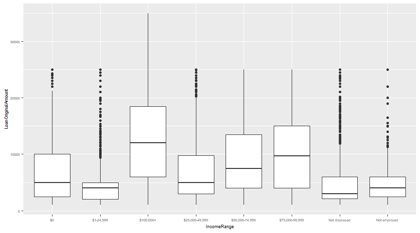

    ## loan_data$IncomeRange: $0
    ##    Min. 1st Qu.  Median    Mean 3rd Qu.    Max. 
    ##    1000    2500    5000    7411   10000   25000 
    ## -------------------------------------------------------- 
    ## loan_data$IncomeRange: $1-24,999
    ##    Min. 1st Qu.  Median    Mean 3rd Qu.    Max. 
    ##    1000    2052    4000    4274    5000   25000 
    ## -------------------------------------------------------- 
    ## loan_data$IncomeRange: $100,000+
    ##    Min. 1st Qu.  Median    Mean 3rd Qu.    Max. 
    ##    1000    6000   12000   13073   18500   35000 
    ## -------------------------------------------------------- 
    ## loan_data$IncomeRange: $25,000-49,999
    ##    Min. 1st Qu.  Median    Mean 3rd Qu.    Max. 
    ##    1000    3000    5000    6178    9800   25000 
    ## -------------------------------------------------------- 
    ## loan_data$IncomeRange: $50,000-74,999
    ##    Min. 1st Qu.  Median    Mean 3rd Qu.    Max. 
    ##    1000    4000    7500    8675   13500   25000 
    ## -------------------------------------------------------- 
    ## loan_data$IncomeRange: $75,000-99,999
    ##    Min. 1st Qu.  Median    Mean 3rd Qu.    Max. 
    ##    1000    4000    9700   10366   15000   25000 
    ## -------------------------------------------------------- 
    ## loan_data$IncomeRange: Not displayed
    ##    Min. 1st Qu.  Median    Mean 3rd Qu.    Max. 
    ##    1000    2100    3033    5170    6001   25000 
    ## -------------------------------------------------------- 
    ## loan_data$IncomeRange: Not employed
    ##    Min. 1st Qu.  Median    Mean 3rd Qu.    Max. 
    ##    1000    2500    4000    4885    6000   25000

### CreditRating versus the loan amount

we can see from the boxplot how that for each score rating we have a different loan amount as can be seen in the summary and the boxplot. And as expected that the higher credit rating get higher loan amount by comparing the median for each of the ratings. The exceptional rating has the most followed by the very good and the least amount was given to the very poor rating.

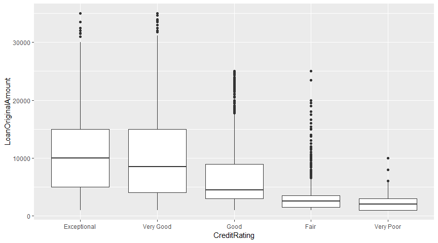

    ## loan_data.without_na_creditRating$CreditRating: Exceptional
    ##    Min. 1st Qu.  Median    Mean 3rd Qu.    Max. 
    ##    1000    5000   10000   11001   15000   35000 
    ## -------------------------------------------------------- 
    ## loan_data.without_na_creditRating$CreditRating: Very Good
    ##    Min. 1st Qu.  Median    Mean 3rd Qu.    Max. 
    ##    1000    4000    8500    9594   15000   35000 
    ## -------------------------------------------------------- 
    ## loan_data.without_na_creditRating$CreditRating: Good
    ##    Min. 1st Qu.  Median    Mean 3rd Qu.    Max. 
    ##    1000    3000    4500    6362    8900   25000 
    ## -------------------------------------------------------- 
    ## loan_data.without_na_creditRating$CreditRating: Fair
    ##    Min. 1st Qu.  Median    Mean 3rd Qu.    Max. 
    ##    1000    1500    2550    2898    3500   25000 
    ## -------------------------------------------------------- 
    ## loan_data.without_na_creditRating$CreditRating: Very Poor
    ##    Min. 1st Qu.  Median    Mean 3rd Qu.    Max. 
    ##    1000    1000    2000    2285    3000   10000 
    ## -------------------------------------------------------- 
    ## loan_data.without_na_creditRating$CreditRating: 0
    ## NULL

### DebtToIncomeratio versus the loan amount

from the scatter plot it seems that loan amount is not affected much by the income with debtToincome ratio and this confirmed by the correlation test which gives a corrlation of 0.01 which is very weak correlation.

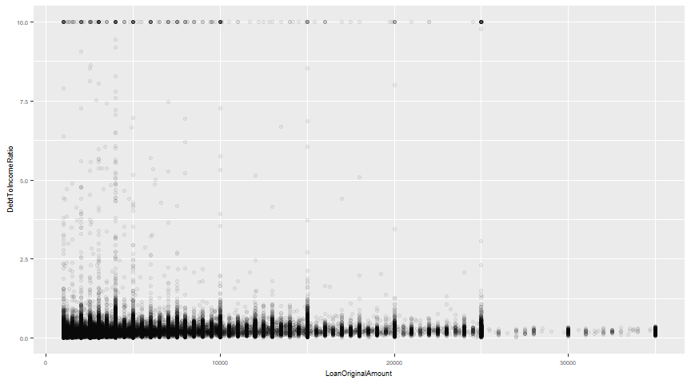

    ## 
    ##  Pearson's product-moment correlation
    ## 
    ## data:  DebtToIncomeRatio_subset$LoanOriginalAmount and DebtToIncomeRatio_subset$DebtToIncomeRatio
    ## t = 3.2828, df = 105380, p-value = 0.001028
    ## alternative hypothesis: true correlation is not equal to 0
    ## 95 percent confidence interval:
    ##  0.004074882 0.016148830
    ## sample estimates:
    ##        cor 
    ## 0.01011222

### borrowerRate versus the loan amount

from the scatter plot it seems that for larger loan amounts the borrower rate decrease as expected and and the correlation between the loan amount and the borrowerRate is 0.3289.

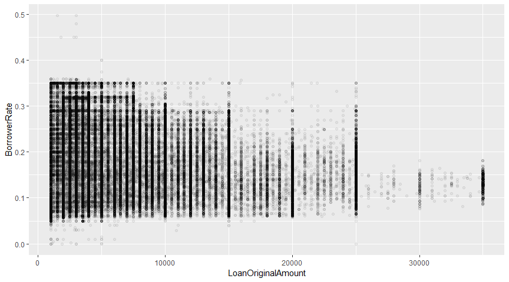

    ## 
    ##  Pearson's product-moment correlation
    ## 
    ## data:  loan_data$LoanOriginalAmount and loan_data$BorrowerRate
    ## t = -117.58, df = 113940, p-value < 0.00000000000000022
    ## alternative hypothesis: true correlation is not equal to 0
    ## 95 percent confidence interval:
    ##  -0.3341283 -0.3237719
    ## sample estimates:
    ##        cor 
    ## -0.3289599

### borrowerAPR versus the loan amount

from the scatter plot it seems that for larger loan amounts the borrowerAPR decrease as expected and and the correlation between the loan amount and the borrowerRate is 0.322.

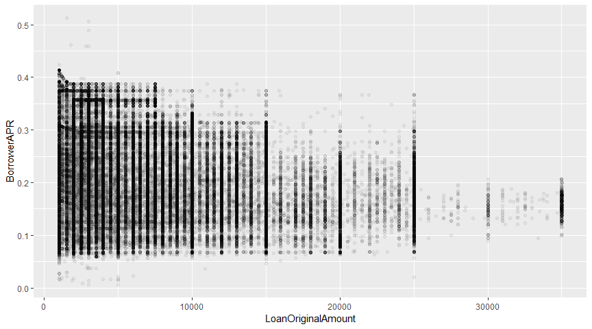

    ## 
    ##  Pearson's product-moment correlation
    ## 
    ## data:  loan_data$LoanOriginalAmount and loan_data$BorrowerAPR
    ## t = -115.14, df = 113910, p-value < 0.00000000000000022
    ## alternative hypothesis: true correlation is not equal to 0
    ## 95 percent confidence interval:
    ##  -0.3280787 -0.3176752
    ## sample estimates:
    ##        cor 
    ## -0.3228867

### TotalProsperLoans versus the loan amount

from the scatter plot it seems that loan amount is not affected much by the number of the previous loans and this confirmed by the correlation test which gives a corrlation of 0.06 which is very weak correlation.

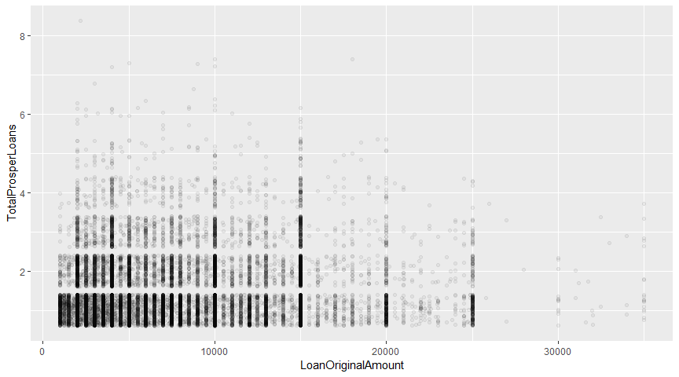

    ## 
    ##  Pearson's product-moment correlation
    ## 
    ## data:  LoanOriginalAmount and TotalProsperLoans
    ## t = 9.8992, df = 22082, p-value < 0.00000000000000022
    ## alternative hypothesis: true correlation is not equal to 0
    ## 95 percent confidence interval:
    ##  0.05332679 0.07958837
    ## sample estimates:
    ##        cor 
    ## 0.06646909

Now we want to look into the loan status and see what might affect it. we are interested in 3 loan categories: completed, charged off and default.

### Loan Year versus the average loan amount and average borrowerRate

The largest loan amount was in 2014 = 11915 and the least was in 2005 with an average of 3857. the borrower rate is the least in 2005 = 0.935 and the highest in 2011 = 0.23. we can see also that the loan amount and the borrowerRate don't follow the same trend in terms of increase or drop.

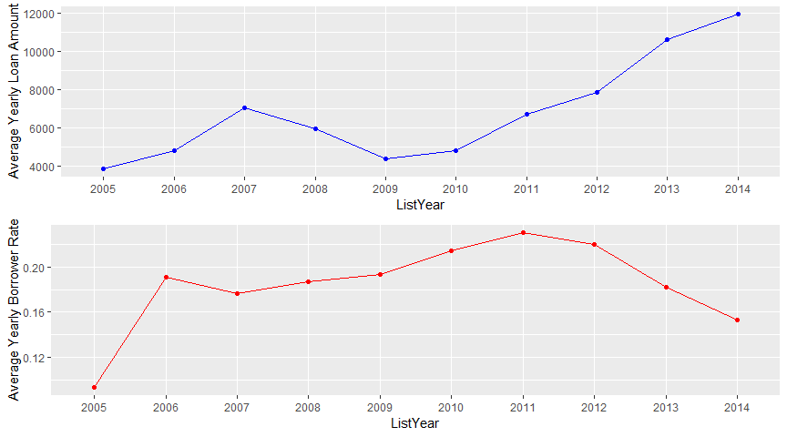

### loanStatus versus the loan amount

we can see a varying loan amount for different loan status with the current loans having the highest amount and the cancelled having the least loan amount. comparing the charged off, completed and defaulted loans in terms of loan amount to see if it is a factor. we can see they don't differ much except in the max loan amount for the completed status while the median and min being very close loan amounts.

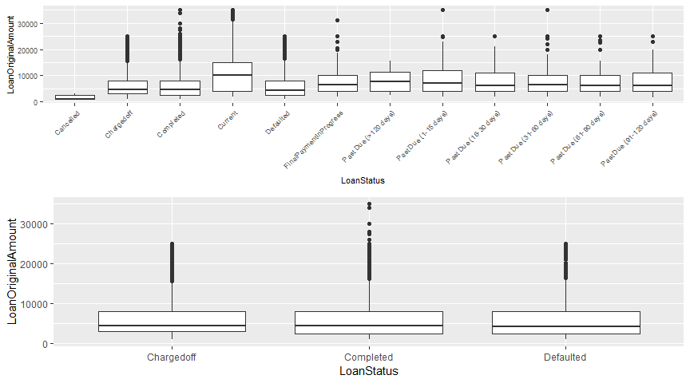

    ## loan_data$LoanStatus: Cancelled
    ##    Min. 1st Qu.  Median    Mean 3rd Qu.    Max. 
    ##    1000    1000    1000    1700    2500    3000 
    ## -------------------------------------------------------- 
    ## loan_data$LoanStatus: Chargedoff
    ##    Min. 1st Qu.  Median    Mean 3rd Qu.    Max. 
    ##    1000    3000    4500    6399    8000   25000 
    ## -------------------------------------------------------- 
    ## loan_data$LoanStatus: Completed
    ##    Min. 1st Qu.  Median    Mean 3rd Qu.    Max. 
    ##    1000    2550    4500    6189    8000   35000 
    ## -------------------------------------------------------- 
    ## loan_data$LoanStatus: Current
    ##    Min. 1st Qu.  Median    Mean 3rd Qu.    Max. 
    ##    2000    4000   10000   10361   15000   35000 
    ## -------------------------------------------------------- 
    ## loan_data$LoanStatus: Defaulted
    ##    Min. 1st Qu.  Median    Mean 3rd Qu.    Max. 
    ##    1000    2550    4275    6487    8000   25000 
    ## -------------------------------------------------------- 
    ## loan_data$LoanStatus: FinalPaymentInProgress
    ##    Min. 1st Qu.  Median    Mean 3rd Qu.    Max. 
    ##    2000    4000    6500    8346   10000   31000 
    ## -------------------------------------------------------- 
    ## loan_data$LoanStatus: Past Due (>120 days)
    ##    Min. 1st Qu.  Median    Mean 3rd Qu.    Max. 
    ##    2500    4000    7500    8281   11250   15500 
    ## -------------------------------------------------------- 
    ## loan_data$LoanStatus: Past Due (1-15 days)
    ##    Min. 1st Qu.  Median    Mean 3rd Qu.    Max. 
    ##    2000    4000    7000    8468   12000   35000 
    ## -------------------------------------------------------- 
    ## loan_data$LoanStatus: Past Due (16-30 days)
    ##    Min. 1st Qu.  Median    Mean 3rd Qu.    Max. 
    ##    2000    4000    6000    8156   11129   25000 
    ## -------------------------------------------------------- 
    ## loan_data$LoanStatus: Past Due (31-60 days)
    ##    Min. 1st Qu.  Median    Mean 3rd Qu.    Max. 
    ##    2000    4000    6500    8534   10000   35000 
    ## -------------------------------------------------------- 
    ## loan_data$LoanStatus: Past Due (61-90 days)
    ##    Min. 1st Qu.  Median    Mean 3rd Qu.    Max. 
    ##    2000    4000    6000    7730   10000   25000 
    ## -------------------------------------------------------- 
    ## loan_data$LoanStatus: Past Due (91-120 days)
    ##    Min. 1st Qu.  Median    Mean 3rd Qu.    Max. 
    ##    1500    4000    6000    8004   11000   25000

### debtToIncomeRatio versus the loan status

we can see a varying debt to income ratio is associated with different loan status with the least debt to income ratio for the cancelled status followed by the completed loans and higher debt to income ratio is found with the defaulted loans followed by the charged off loans and the ones that are past due.

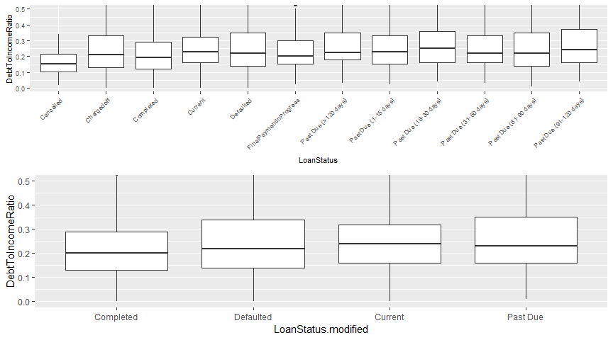

    ## loan_data$LoanStatus.modified: Completed
    ##    Min. 1st Qu.  Median    Mean 3rd Qu.    Max.    NA's 
    ##  0.0000  0.1200  0.1900  0.2641  0.2900 10.0100    2734 
    ## -------------------------------------------------------- 
    ## loan_data$LoanStatus.modified: Defaulted
    ##    Min. 1st Qu.  Median    Mean 3rd Qu.    Max.    NA's 
    ##  0.0000  0.1393  0.2200  0.3484  0.3300 10.0100    1496 
    ## -------------------------------------------------------- 
    ## loan_data$LoanStatus.modified: Current
    ##    Min. 1st Qu.  Median    Mean 3rd Qu.    Max.    NA's 
    ##   0.000   0.160   0.230   0.262   0.320  10.010    4114 
    ## -------------------------------------------------------- 
    ## loan_data$LoanStatus.modified: Past Due
    ##    Min. 1st Qu.  Median    Mean 3rd Qu.    Max.    NA's 
    ##  0.0100  0.1600  0.2300  0.2934  0.3500 10.0100     210

### list year versus the loan status

This show the distrubtion of different loan status across the years.In 2012-2014 most of the loans are current. more loans are completed than defaulted in this dataset. between 2006-2007 the defaulted loans percentage was around 39.00% compared to around 60% completed after 2008 the percentage dropped to 32% and in 2009 it dropped to 15%. it is good to note that these higher defaulted percentage were pre the economic crises in 2009.

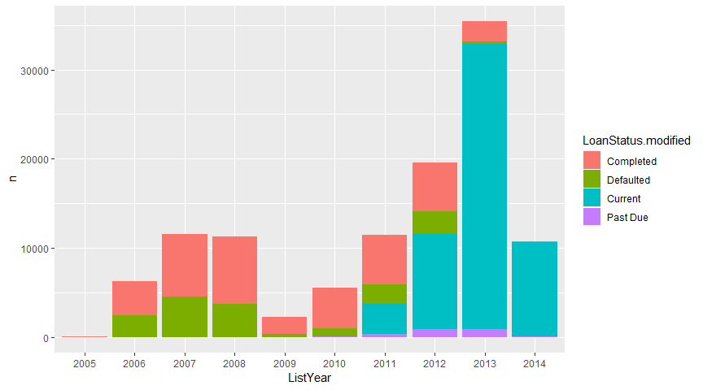

    ## # A tibble: 28 x 6
    ## # Groups:   ListYear [10]
    ##    ListYear LoanStatus.modi~ avg_loan_amount avg_borrower_ra~     n
    ##    <fct>    <fct>                      <dbl>            <dbl> <int>
    ##  1 2005     Completed                  3856.           0.0935    23
    ##  2 2006     Completed                  4889.           0.169   3755
    ##  3 2006     Defaulted                  4778.           0.225   2458
    ##  4 2007     Completed                  6629.           0.157   7041
    ##  5 2007     Defaulted                  7749.           0.207   4516
    ##  6 2008     Completed                  5812.           0.171   7571
    ##  7 2008     Defaulted                  6277.           0.219   3692
    ##  8 2009     Completed                  4437.           0.186   1870
    ##  9 2009     Defaulted                  4151.           0.237    336
    ## 10 2010     Completed                  4893.           0.205   4566
    ## # ... with 18 more rows, and 1 more variable: percentage <dbl>

### CreditRating versus the loan status

looking at the different CreditRating versus the loan status percentage. we can for the better ratings we have more completed loans compared to the defaulted ones while the Very poor rating had higher default percentage compared to the compeleted loans. - Exceptional Rating had 41.9% completed, 8% defaulted and 1.31% pastdue loans - Very Good Rating had 27.9% completed, 9.87% defaulted and 1.95% Pastdue loans - Good Rating had 34% completed, 18% defaulted and 2.23% Pastdue loans - Fair Rating had 45% completed and 55% defaulted. - Very Poor Rating had 29% completed, 70.7% defaulted.

    ## # A tibble: 16 x 6
    ## # Groups:   CreditRating [5]
    ##    CreditRating LoanStatus.modi~ avg_loan_amount avg_borrower_ra~     n
    ##    <ord>        <fct>                      <dbl>            <dbl> <int>
    ##  1 Exceptional  Completed                  8478.            0.120  5817
    ##  2 Exceptional  Defaulted                 11727.            0.169  1110
    ##  3 Exceptional  Current                   13051.            0.132  6765
    ##  4 Exceptional  Past Due                  10986.            0.191   182
    ##  5 Very Good    Completed                  6928.            0.181 15126
    ##  6 Very Good    Defaulted                  8459.            0.217  5343
    ##  7 Very Good    Current                   11039.            0.176 32627
    ##  8 Very Good    Past Due                   8878.            0.227  1057
    ##  9 Good         Completed                  4806.            0.221 12360
    ## 10 Good         Defaulted                  5746.            0.238  6547
    ## 11 Good         Current                    7742.            0.224 16620
    ## 12 Good         Past Due                   6731.            0.256   812
    ## 13 Fair         Completed                  2772.            0.246  2983
    ## 14 Fair         Defaulted                  3001.            0.263  3649
    ## 15 Very Poor    Completed                  2180.            0.211    39
    ## 16 Very Poor    Defaulted                  2329.            0.232    94
    ## # ... with 1 more variable: percentage <dbl>

### AvailableBankcardCredit versus borrowerRate

The two variables have a correlation of -0.344. higher bankcredit is correlated with smaller borrowerRate.

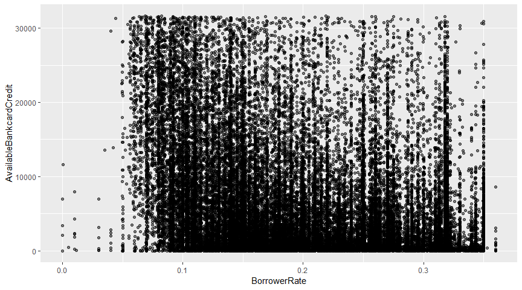

    ## 
    ##  Pearson's product-moment correlation
    ## 
    ## data:  loan_data$AvailableBankcardCredit and loan_data$BorrowerRate
    ## t = -119.44, df = 106390, p-value < 0.00000000000000022
    ## alternative hypothesis: true correlation is not equal to 0
    ## 95 percent confidence interval:
    ##  -0.3491486 -0.3385518
    ## sample estimates:
    ##        cor 
    ## -0.3438611

Bivariate Analysis
==================

### Talk about some of the relationships you observed in this part of the . How did the feature(s) of interest vary with other features in

dataset? In this part am trying to look into two things: first, the variables that might is related to the borrower that affect the loan amount given to the borrower so i looked into the following variables(Employmentstatus, Income Range, CreditRating, listing category, TotalProsperLoans, DebtToIncomeRatio). secondly: the factors that can be associated with the loan status.

-   employment status: from the analysis we saw that different status had different loan amounts and the highest loans were given to the employed and the least to the part timers.

-   Income range: the relationship was as expected overall with the highest loan amounts were given to the Income ranges of 100,000+, and the least amount given to the income range less than 25000. the only anamoly seemed with income 0 that was not with the least amount of loan given though 0 might be for NA values.

-creditRating: as expected that the higher credit rating got higher loan amount by comparing the median for each of the ratings. The exceptional rating has the most followed by the very good and the least amount was given to the very poor rating.

-   debtoincome ratio: it seems that loan amount is not affected much by the debtToincome ratio and this confirmed by the correlation test which gives a corrlation of 0.01.

-   listing category: we saw that each categorylisting had different loan amount ranges and the category that got the highest loan amount was the Debt Consolidation and the least was for the student use.

-   TotalProsperLoans: loan amount is not affected much by the number of the previous loans and this confirmed by the correlation test which gives a corrlation of 0.06.

-   loan amount: comparing the charged off, completed and defaulted loans in terms of loan amount to see if it is a factor. we can see they don't differ much except in the max loan amount for the completed status while the median and min being very close loan amounts

-   DebtToIncomeRatio: we can see a varying debt to income ratio is associated with different loan status with the least debt to income ratio for the cancelled status followed by the completed loans and higher debt to income ratio is found with the defaulted loans followed by the charged off loans and the ones that are past due

-   CreditRating versus the loan status percentage. higher credit ratings had more completed percentages compared to the defaulted ones while the Very poor rating had higher defaulted percentage.

-   borrower rate versus loan amount: for larger loan amounts the borrower rate decrease as expected and and the correlation between the loan amount and the borrowerRate is 0.3289.

-   loan amount and borrowerRate across the years: We can see also that the loan amount and the borrowerRate don't follow the same trend in terms of increase or drop.

### Did you observe any interesting relationships between the other features

 (not the main feature(s) of interest)? Loan status across the years. Between the years 2006-2007 the defaulted loans percentage was around 39.00% with around 60% completed and after 2008 the percentage dropped to 32% and in 2009 it dropped to 15%. it is good to note that these higher defaulted percentage were pre the economic crises in 2009.

### What was the strongest relationship you found?

-   loanstatus versus the DebtToIncomeRatio

-   IncomeRange versus the loanAmount

-   creditRating versus loanAmount

-   borrowerRate versus loanAmount

-   creditRating versus loanStatus

-   AvailableBankcardCredit versus borrowerRate

Multivariate Plots Section
==========================

### DebtTOincomeRatio versus loanStatus and CreditRating:

we can see that for all the different creditRatings the completed loans are the ones with the lowest DebtToIncomeRatio and the highest is for the Defaulted loans.

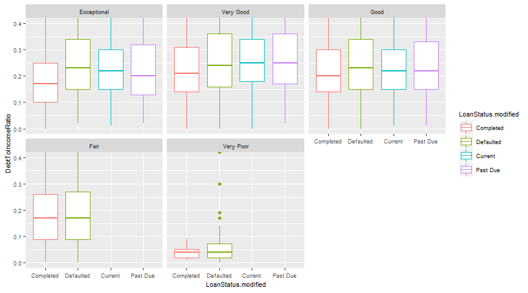

### average loan amount for each Listing year vs loan status

It seems that loan amount is not related to the completed or default loans across the years.

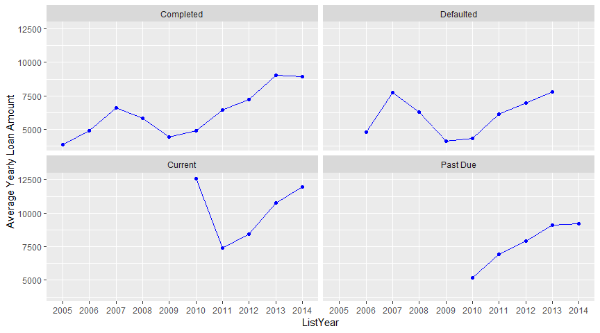

### average borrowerRate for each Listing year vs loan status

it seems that higher borrowerRates are more likely to be defaulted loans compared to other loans.

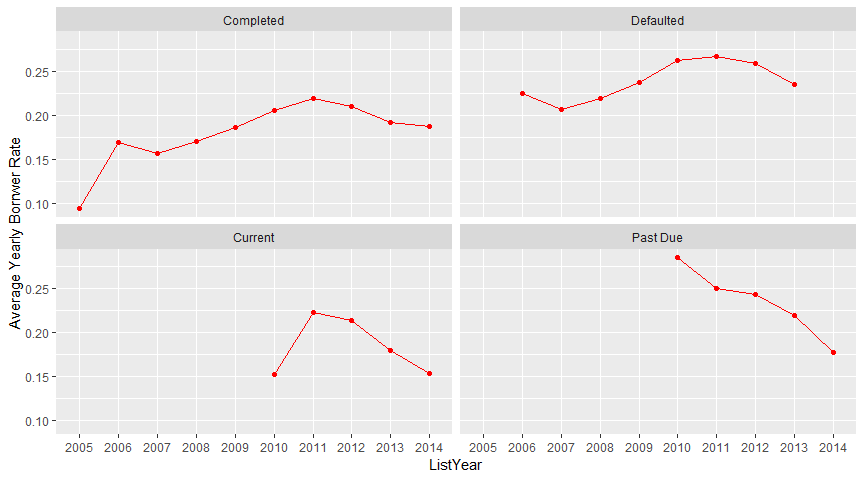

### loanAmount vs loan status, borrowerRate:

we can see that most of the defaulted loans have a higher borrowerRate and low loan while most completed lay with low loans and low borrowerrate.

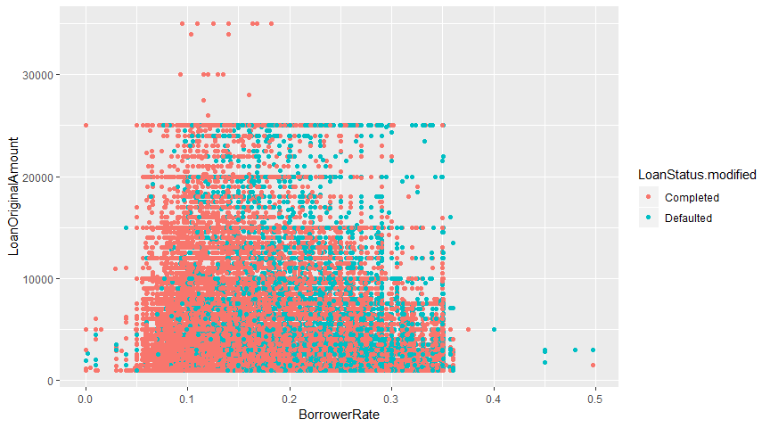

### DebtTOincomeRatio versus loanStatus and Term:

For shorter loans 12 term the pastdue had the highest debtTOincome Ratio while the current and default had close ratio. for 36 and 60 terms the pastdue still had a higher ratio compared to the default though the longer the period of the loan, the smaller the difference is between these two periods. and across all the terms the completed had the lowest DebtToIncomeRatio.

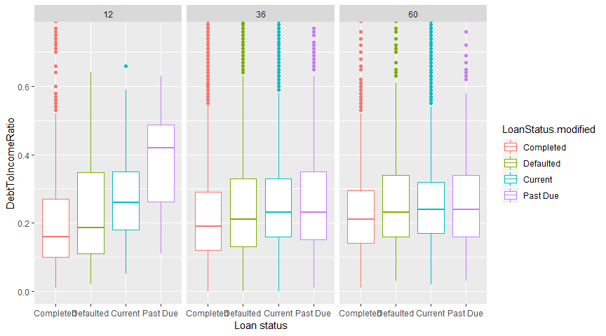

### AvailableBankcardCredit versus borrowerRate and loanStatus:

we know that AvailableBankcardCredit and borrowerRate has a correlation of 0.34 but when the 3 variables were combined it was clearer that lower borrowerRate

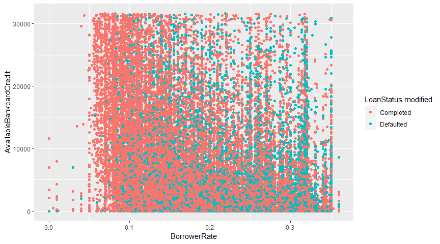

Multivariate Analysis
=====================

### Talk about some of the relationships you observed in this part of the . Were there features that strengthened each other in terms of at your feature(s) of interest?

-   DebtTOincomeRatio versus loanStatus and CreditRating: we can see that for all the different creditRatings the completed loans are the ones with the lowest DebtToIncomeRatio and the highest is for the Defaulted loans.Though i would expect that the better creditRating the lower the debtToIncome Ratio but this was not the case.

-   average yearly loan amount and the loan status: It seems that loan amount is not related to the completed or default loans across the years. but it seems that the trend for different loan status is not the same across the years. so this can be used as a variable to get the profiles for defaulted and completed loans.

-   average borrowerRate for each Listing year vs loan status: it seems that higher borrowerRates are more likely to be defaulted loans compared to other loans and also the trend across the year is matching for different loan types so we can see that the borrwerRate starts to decrease in 2011 and this seen across all the loan Types.

-loanAmount vs loan status, borrowerRate: most of the defaulted loans have a higher borrowerRate and low loan while most completed lay with low loans and low borrowerrates.

-   DebtTOincomeRatio versus loanStatus and Term: For shorter loans 12 term the pastdue had the highest debtTOincome Ratio while the current and default had close ratio. for 36 and 60 terms the pastdue still had a higher ratio compared to the default though the longer the period of the loan, the smaller the difference is between these two periods. and across all the terms the completed had the lowest debtTo incomeratio

-   AvailableBankcardCredit, borrowerRate and loanStatus: the completed loans are more towards the left of the figure with lower borrowerRate and different available bankcredit compared to defaulted with higher borrwerRates and loan bankcredit which is expected.

### Were there any interesting or surprising interactions between features?

The seperation in defaulted loans and completed loans against borrowerRate and available bank credit.

### OPTIONAL: Did you create any models with your dataset? Discuss the

and limitations of your model.

not applicable

------------------------------------------------------------------------

Final Plots and Summary
=======================

### Plot One

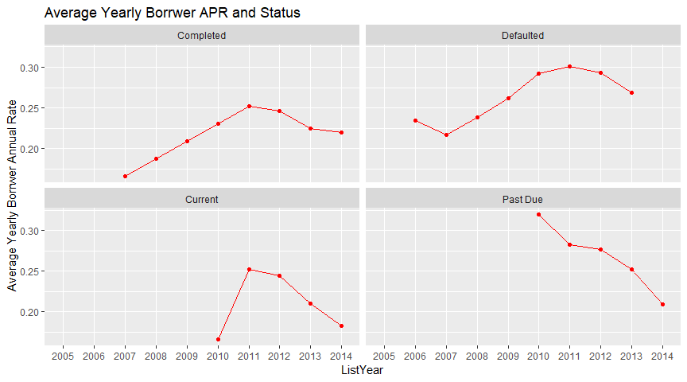

### Description One

This graph shows the average yearly borrowerAPR comparing it across different loan status. observing the different loan status we can see that the defaulted loans had the highest APR across the years. and there was an increase in the borrwerAPR till 2011 and then it started to decrease in the following years for differnt loan status. also for 2010 the highest peak in the borrowerAPR is present in the PastDue loans which can be expected after the economical crises in mid 2009. a note that before year 2010 the loan status had completed and defaulted loans status were present only.

### Plot Two

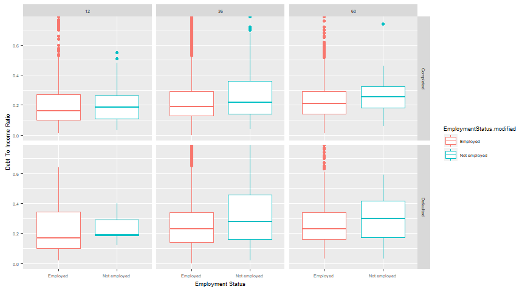

### Description Two

-   it seems that for shorter loans 12 it is unlikely to give unemployed invidiudals these terms (in this dataset we only had one unemployed individual).

-   as expected the unemployed had a higher debt to income ratio and those who defaulted all have higher debt to income ratio regardless of the employement.

-   also for the long term loans all of the unemployed individuals defaulted the loans

### Plot Three

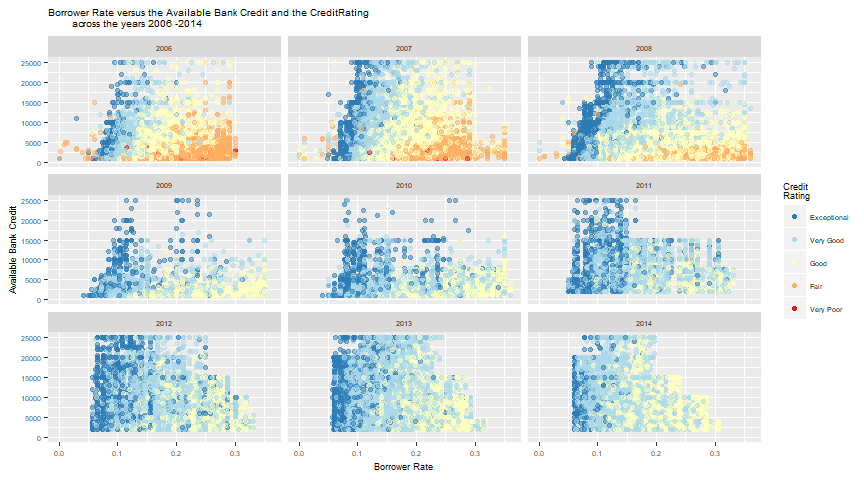

### Description Three

-I used this figure to study the distribution of the different CreditRating across the years 2006-2014 according to the available bank credit and the borrowerRate correlation.

-the first thing that is noticable that Fair credit Rating was more visible in the years before 2009 (the economic crisies)where it is assccoiated with higher borrower rate and lower bank credit but it seems after the economic crisies less people with this credit Rating got loans and more people with ratings of good and higher were given loans.

-   the borrower rate seemed to depend on the available bank credit.

-   the data is almost segmented for each rating with most of the lower borrowerRates is given to the exceptional rating followed by the very good rating which seems as the most common loans rating after year 2009.

------------------------------------------------------------------------

Reflection
==========

In this Exploration we looked into porpser loans dataset and trying to understand the characterisitcs of the borrowers and the loan attributes

-   the given loan amount was subject to the following variables: employmenet status, credit rating (result from the creditscore), Income range, loan listing, borrower rate.

-   the completion of the loans was subject to: Debt To income Ratio, borrowerRate , CreditRating, Term.

-   Most of the loans are listed under Debt Consolidation category and the least listings are for RVs.

-   The categories in the loan status are: Cancelled, Chargedoff, Completed, Current, Defaulted, FinalPaymentInProgress, PastDue. Though most of the loans presented are listed under current loans. To make the analysis easier i combined the loan staus together and resulting in current loans percentage of 49%, pastdue is around 2%, defaulted around 15% and completed around 33%

-   The percentage of the Employed in the data we have is 59.1%. and the percent of not employed is 0.733%.

-   observing the number of loan listings across the years; the least was in 2005 which is the year the propser company was founded and then year 2009 since it is follows the economical crisises and the investment bank Lehman Brothers.

-   Between the years 2006-2007 the defaulted loans percentage was around 39.00% with around 60% completed and after 2008 the percentage dropped to 32% and in 2009 it dropped to 15%. it is good to note that these higher defaulted percentage were pre the economic crises in 2009.

-   In year 2010 following the economic crises there was an increase in the borrower rates.

-   Loan Term : most of the given loans had a term length of 36. For shorter loans 12 term the pastdue had the highest debtTOincome Ratio while the current and default had close ratio. for 36 and 60 terms the pastdue still had a higher ratio compared to the default though the longer the period of the loan, the smaller the difference is between these two periods. and across all the terms the completed had the lowest DebtToIncomeRatio. and as expected the unemployed had a higher debt to income ratio and those who defaulted all have higher debt to income ratio regardless of the employement. also for the long term loans all of the unemployed individuals defaulted the loans.

-   The Fair credit Rating was more visible in the years before 2009 (the economic crisies) where it is assccoiated with higher borrower rate and lower bank credit but it seems after the economic crisies less people with this credit Rating got loans and more people with ratings of good and higher were given loans. after year 2009 most of the lower borrowerRates is given to the exceptional rating followed by the very good rating and it seems it is most common loans rating after year 2009.

Resources:
==========

-   <https://stats.stackexchange.com/questions/798/calculating-optimal-number-of-bins-in-a-histogram>
-   <https://www.experian.com/blogs/ask-experian/credit-education/score-basics/what-is-a-good-credit-score/>
-   <https://www.forbes.com/sites/investopedia/2013/08/06/the-basics-of-lines-of-credit/#72d8b1284263>
-   <https://en.wikipedia.org/wiki/Credit_score>
-   <https://www.badcredit.org/delinquencies-defaults-charge-offs-whats-difference/>
-   <https://www.consumerfinance.gov/ask-cfpb/what-is-the-difference-between-a-mortgage-interest-rate-and-an-apr-en-135/>
